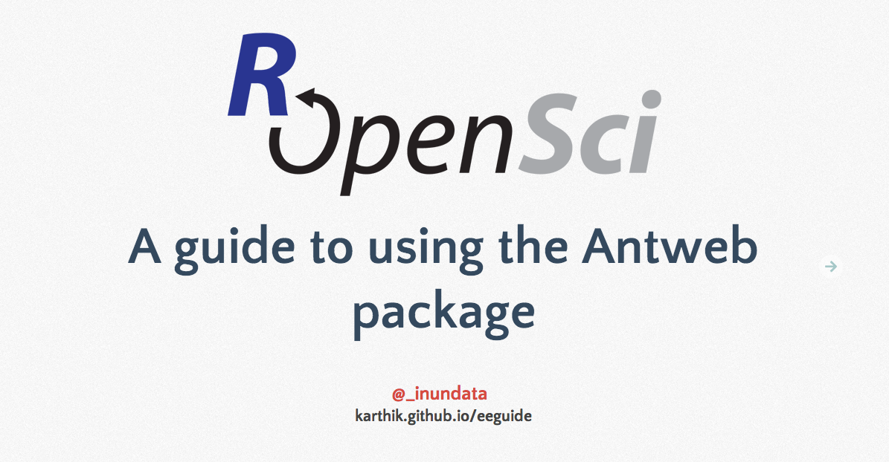

### Big CB lunch time talk.  
_Feb 25, 2014_

A quick demo of how to use the ecoengine R package.


[](http://karthik.github.io/eeguide/)


__To install packages used in this demo__

```coffee
install.packages("ecoengine", dependencies = TRUE)
install.packages("dplyr")
```

__Packages in development__

```coffee
library(devtools)
# If you've never installed devtools before,
# See → https://github.com/ropensci/rOpenSci/wiki/Installing-devtools
install_github('ramnathv/rCharts@dev')
install_github('ramnathv/rMaps')
```

__To knit this presentation__

```coffee
# Edit the index.Rhtml file if you need to
library(knitr)
knit('index.Rhtml')
# or from the command line
make slides
```

Questions or comments to karthik dot ram at gmail dot com


License: CC-BY.